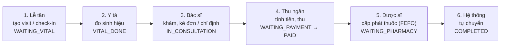

# Bộ Kịch Bản Vận Hành Theo Vai Trò — Clinic CMS (TASK-052)

Bộ **kịch bản kiểm thử end-to-end (E2E)** mô phỏng luồng vận hành thực tế của phòng khám.
Mỗi bước trong kịch bản do **đúng vai trò / tài khoản demo** thực hiện: đăng nhập riêng để lấy
token, thao tác theo quyền của mình, rồi bàn giao trạng thái hợp lệ cho vai trò kế tiếp.
Mục tiêu: xác minh luồng nghiệp vụ liên vai trò, state machine của Visit/Invoice, phân quyền
chéo (403), và cô lập dữ liệu đa tenant (RLS).

> Thuộc **TASK-052**. Đây là tài liệu kịch bản (đầu vào để tự động hóa / kiểm thử thủ công),
> không phải báo cáo kết quả. Bổ sung cho bộ catalog theo-function (`../functional`, `../non-functional`).

---

## 1. Tài khoản demo theo vai trò

Nguồn: `seed_demo_data.py`. Tất cả tài khoản thuộc cùng một clinic demo (trừ tài khoản
cross-tenant dùng cho case RLS).

| Vai trò | Tài khoản | Mật khẩu demo |
|---|---|---|
| Admin (Quản trị) | `admin` | `Demo@1234` |
| Bác sĩ | `dr_nguyen`, `dr_le`, `dr_tran`, `dr_pham`, `dr_hoang` | `Doctor@1234` |
| Y tá | `nurse_lan`, `nurse_huong`, `nurse_linh` | `Nurse@1234` |
| Lễ tân | `recept_anh`, `recept_binh` | `Recept@1234` |
| Dược sĩ | `pharm_cuong`, `pharm_dung` | `Pharm@1234` |
| Thu ngân | `cashier_em` | `Cashier@1234` |

> Các case RLS đa tenant dùng thêm tài khoản admin/clinic khác (Clinic B) để chứng minh cô lập
> dữ liệu (đọc/ghi chéo clinic → 404/403).

---

## 2. Sơ đồ luồng khám chuẩn (6 bước)



Dạng text:

```
Lễ tân → Y tá → Bác sĩ → Thu ngân → Dược sĩ → COMPLETED
WAITING_VITAL → VITAL_DONE → IN_CONSULTATION → {WAITING_PHARMACY | WAITING_PAYMENT} → COMPLETED
```

> **State machine THỰC TẾ** (theo `state_machine.py`, không phải tên rút gọn của BA gốc):
> `WAITING_VITAL → VITAL_DONE → IN_CONSULTATION → {PAUSED, WAITING_PHARMACY, WAITING_PAYMENT,
> COMPLETED}`; trạng thái kết thúc khác: `NO_SHOW`, `CANCELLED`.
> Invoice: `DRAFT → ISSUED → PARTIALLY_PAID → PAID`; nhánh `VOIDED / REFUNDED`.
> Ca chỉ định dịch vụ kỹ thuật (không có thuốc) đi thẳng `WAITING_PAYMENT` (bỏ qua bước Dược sĩ).

---

## 3. Bốn nhóm kịch bản

| Nhóm | File | Số kịch bản | Vai trò tham gia |
|---|---|---|---|
| Happy Path (luồng thuận) | [happy-path-scenarios.md](happy-path-scenarios.md) | 5 | Lễ tân, Y tá, Bác sĩ, Thu ngân, Dược sĩ, Hệ thống (auto COMPLETED) |
| Biến thể (variants) | [variants-scenarios.md](variants-scenarios.md) | 7 | Lễ tân, Y tá, Bác sĩ, Thu ngân, Dược sĩ, Admin; tài khoản cross-tenant + no-token |
| Ngoại lệ & Hủy (exceptions) | [exceptions-scenarios.md](exceptions-scenarios.md) | 8 | Admin, Bác sĩ, Y tá, Lễ tân, Thu ngân, Dược sĩ |
| Phân quyền chéo (cross-role denial) | [cross-role-denial-scenarios.md](cross-role-denial-scenarios.md) | 13 | Lễ tân, Y tá, Bác sĩ, Dược sĩ, Thu ngân, Admin (đối chứng); Admin Clinic A vs Clinic B (RLS) |
| **Tổng** | | **33** | 6 vai trò nghiệp vụ + đa tenant |

**Tóm tắt phạm vi từng nhóm:**

- **Happy Path** — khám tổng quát có kê đơn + cấp thuốc nội viện FEFO; chỉ định dịch vụ kỹ thuật;
  pre-assign bác sĩ từ lễ tân; ca ưu tiên vượt hàng đợi; ca kết hợp dịch vụ + thuốc với
  multi-payment (CASH + BANK_TRANSFER).
- **Biến thể** — tái khám (tìm BN theo SĐT, không tạo trùng); chỉ mua thuốc không khám
  (manual invoice); cấp cứu priority cao; khám nhiều chuyên khoa 1 lần đến (reassign);
  walk-in vs appointment check-in; đơn ngoại viện (`is_internal=false`, không trừ tồn).
- **Ngoại lệ & Hủy** — hủy HĐ đã PAID + hoàn tiền; hủy visit + release reservation;
  no-show; thiếu tồn khi cấp phát; sửa đơn trước cấp phát; thanh toán nhiều đợt + guard
  overpayment; giảm giá vượt ngưỡng cần admin duyệt; đo lại sinh hiệu nhiều lần.
- **Phân quyền chéo** — ma trận từ chối 403 theo BA §13.6 (kê đơn, cấp phát, void HĐ, quản lý
  user, báo cáo tài chính, settings, danh mục kho...) + RLS đa tenant + self-dispense prevention.

---

## 4. Quy ước

**Mã kịch bản:** `SC-<NHÓM>-NN`
- `SC-HP-01..05` (Happy Path), `SC-VAR-01..07` (Variants), `SC-EXC-01..08` (Exceptions),
  `SC-RBAC-01..13` (Cross-role denial).

**Mức ưu tiên:**
- **P0** — luồng chính / bảo mật cốt lõi (happy path đầy đủ 6 vai trò, void HĐ, phân quyền chéo,
  RLS cô lập tenant). Bắt buộc PASS trước khi release.
- **P1** — biến thể nghiệp vụ phổ biến (tái khám, cấp cứu, multi-payment, sửa đơn, no-show).
- **P2** — case ngoại biên / forward-looking (đo lại sinh hiệu nhiều lần, module chưa ship đầy đủ).

**Map về catalog function:**
- Mỗi bước/assertion liên kết tới mã function của catalog theo prefix:
  `VIS-` (visit), `VTL-` (vital), `SVC-` (service), `RX-` (prescription), `PHRM-` (pharmacy),
  `BILL-` (billing), `PAT-` (patient), `APPT-` (appointment), `RBAC-` (phân quyền),
  `TENT-`/TENANT (RLS đa tenant). Test case của catalog dùng prefix `TC-<DOMAIN>-NNN`.
- Truy vết: kịch bản (SC-*) → bước → mã function (VIS/RX/BILL/...) → test case catalog (TC-*).

---

## 5. Ghi chú quan trọng

- **Cột Coverage / endpoint trong các file kịch bản là GỢI Ý** (suy ra từ BA + System Design +
  catalog), **chưa phải hợp đồng API chính thức**. Trước khi tự động hóa **phải đối chiếu lại với
  `openapi.json` và route thực tế trong `app/modules/...`, rồi chạy thực tế xác minh.**
- Nhiều module còn **TODO / PARTIAL** trong nguồn (Vital/VTL, Service/SVC, Prescription/RX,
  Billing/BILL): các endpoint như `/visits/{id}/vitals`, `/visits/{id}/services`, `/prescriptions`,
  `/invoices`, `/invoices/{id}/payments` cần verify route trước khi assert.
- **Drift / GAP đã biết** (assertion có thể FAIL → ghi bug, KHÔNG tự sửa expected):
  void HĐ (`BILL-016`) hiện chưa hoàn kho; VAT (`BILL-012`) hardcode 0; `RX-006` chưa check dị ứng;
  reschedule appointment là GAP; module VITAL chưa ship đầy đủ (SC-EXC-08 mang tính forward-looking).
- Pharmacy queue lọc theo `rx_id` (`PHRM-001`), không theo `visit_id` → cần map `rx → visit` khi assert.
- Mọi kịch bản chạm dữ liệu đều có điểm kiểm chứng **RLS đa tenant** và phân quyền chéo **403**.
